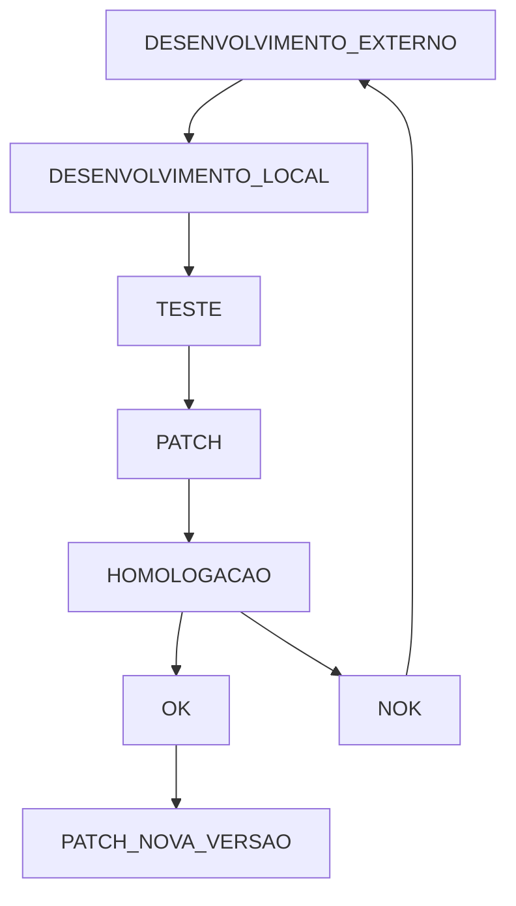
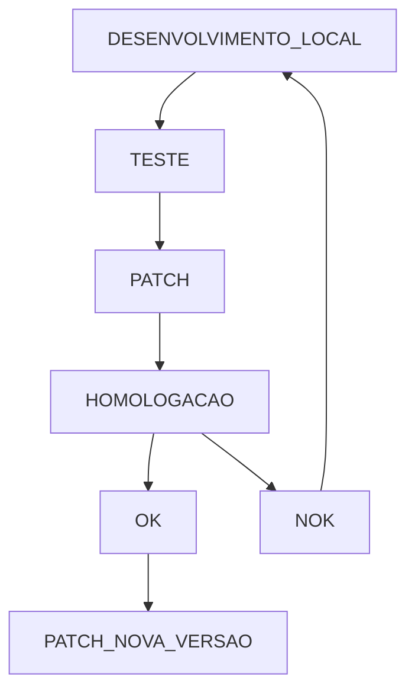

# Bomix
Controle de Fontes Protheus.

#FLUXO DE DESENVOLVIMENTO [BOMIX]

###DESENVOLVIMENTO EXTERNO
IGNORADO PROCESSO DE APROVACAO E REQUISITOS

###DESENVOLVIMENTO INTERNO
IGNORADO PROCESSO DE APROVACAOO E REQUISITOS

